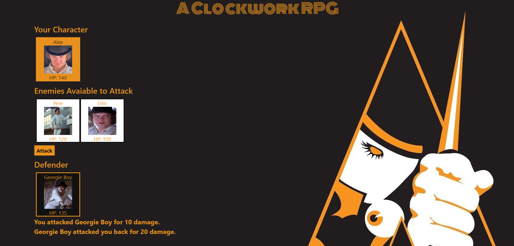

# RPG Game

## RPG Game built with JavaScript and jQuery!

This is an RPG game with "A Clockwork Orange" theme! When the game starts, the player will choose a character by clicking on the fighter's picture. The player will fight as that player for the rest of the game.
The player must then defeat all of the remaining fighters.
The player chooses an opponent by clicking on an enemy's picture and that opponent is moved to the defender area.
Once there is a defender chosen, the player can click the attack button.
Everytime the player clicks attack, the defender's health (HP) is lowered by the player's attack value. The player's attack value grows expotentially as the game progresses. The defender also counter-attacks the player and the player's HP is lowered accordingly.
Once the player defeats all remaining fighters, the player wins!
If the player's HP reaches 0 or lower, the game is over and a restart button will appear.

https://mattauretta.github.io/A-Clockwork-RPG/

